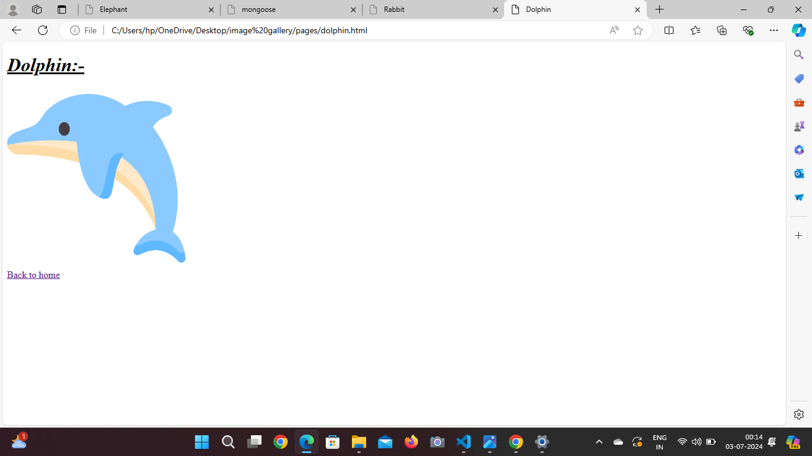

# Image Gallery 🤷‍♂️

Welcome to Image gallerry Handbook!
This is a Open-source Project Serves as a Handbook for various tecnology and programming language taught in Road to Code Course.

wether you are computer science students or you are coading enthusiast this repo will be your go to resource for all the things related to c and c++ and python

